# EfficientMT

Official implementation of the paper "EfficientMT: Efficient Temporal Adaptation for Motion Transfer in Text-to-Video Diffusion Models" [ICCV 2025].

It is an efficient end-to-end model for video motion transfer, which adapts a pretrained T2V model into a motion transfer framework with a few synthetic data training. Flexible subject/camera motion transfer can be performed in a few seconds without additional optimization steps.

**[EfficientMT: Efficient Temporal Adaptation for Motion Transfer in Text-to-Video Diffusion Models](https://arxiv.org/abs/2503.19369)**  
**Yufei Cai, Hu Han, Yuxiang Wei, Shiguang Shan, Xilin Chen**

[](https://arxiv.org/abs/2503.19369) [](https://huggingface.co/yfcai/EfficientMT) [](https://www.modelscope.cn/models/q473680239/EfficientMT)

## Gallery
Online viewing may cause motion desync. We recommend downloading the page to view locally for a better preview.
### Subject Motion
<div align="center">
  <table>
    <tr valign="top">
      <!-- 第一组 -->
      <td>
        <table>
          <tr valign="top">
            <td>
              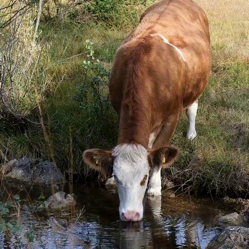</img>
              <div style="width: 200px;">
              <p align="center">Reference video</p>
              </div>
            </td>
            <td>
              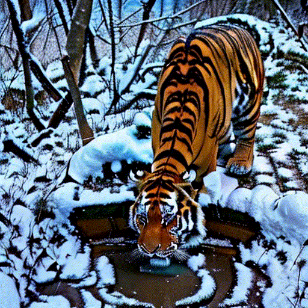</img>
              <div style="width: 200px;">
                <p align="center">tiger, raises its head, in the snow.</p>
              </div>
            </td>
          </tr>
        </table>
      </td>
      <!-- 第二组 -->
      <td>
        <table>
          <tr valign="top">
            <td>
              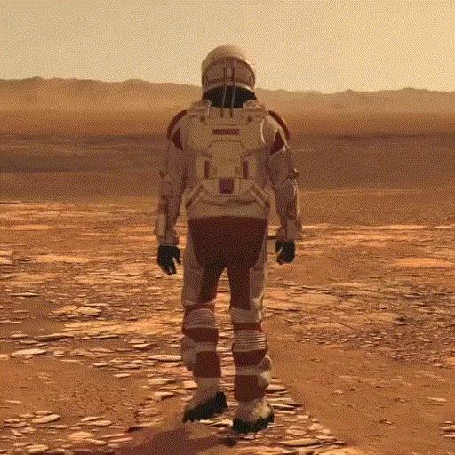</img>
              <div style="width: 200px;">
              <p align="center">Reference video</p>
              </div>
            </td>
            <td>
              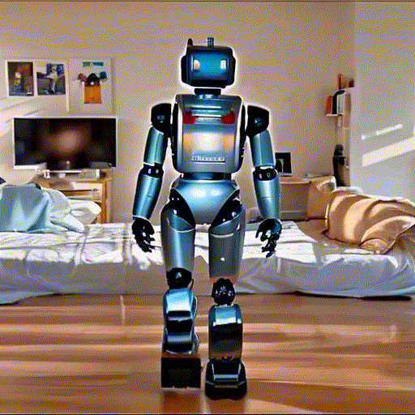</img>
              <div style="width: 200px;">
              <p align="center">robot, walks, in the room.</p>
              </div>
            </td>
          </tr>
        </table>
      </td>
    </tr>
    <tr valign="top">
      <!-- 第一组 -->
      <td>
        <table>
          <tr valign="top">
            <td>
              </img>
              <div style="width: 200px;">
              <p align="center">Reference video</p>
              </div>
            </td>
            <td>
              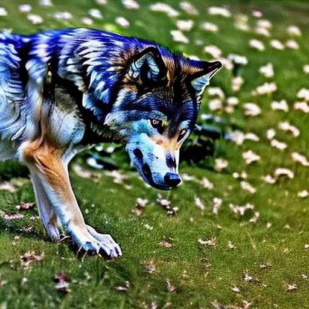</img>
              <div style="width: 200px;">
                <p align="center">wolf, lying down, on the grass.</p>
              </div>
            </td>
          </tr>
        </table>
      </td>
      <!-- 第二组 -->
      <td>
        <table>
          <tr valign="top">
            <td>
              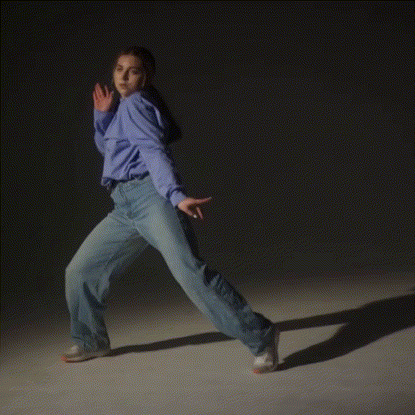</img>
              <div style="width: 200px;">
              <p align="center">Reference video</p>
              </div>
            </td>
            <td>
              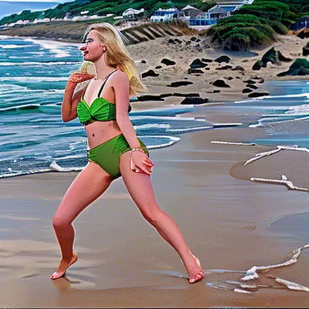</img>
              <div style="width: 200px;">
                <p align="center">blonde, dancing, on the beach.</p>
              </div>
            </td>
          </tr>
        </table>
      </td>
    </tr>
  </table>
</div>

### Camera Motion
<div align="center">
  <table>
    <tr valign="top">
      <!-- 第一组 -->
      <td>
        <table>
          <tr valign="top">
            <td>
              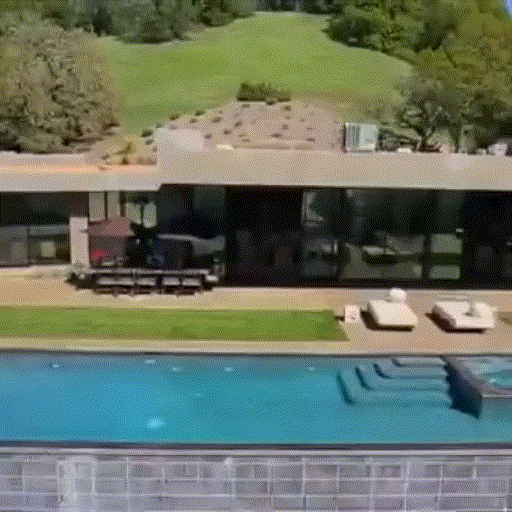</img>
              <div style="width: 200px;">
              <p align="center">Reference video</p>
              </div>
            </td>
            <td>
              </img>
              <div style="width: 200px;">
                <p align="center">A misty waterfall cascading into a clear pool below.</p>
              </div>
            </td>
          </tr>
        </table>
      </td>
      <!-- 第二组 -->
      <td>
        <table>
          <tr valign="top">
            <td>
              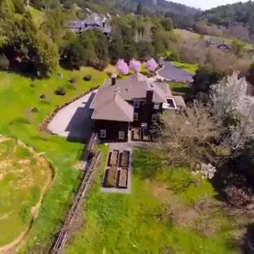</img>
              <div style="width: 200px;">
              <p align="center">Reference video</p>
              </div>
            </td>
            <td>
              </img>
              <div style="width: 200px;">
              <p align="center">A coastal shoreline with waves crashing on jagged rocks.</p>
              </div>
            </td>
          </tr>
        </table>
      </td>
    </tr>
    <tr valign="top">
      <!-- 第一组 -->
      <td>
        <table>
          <tr valign="top">
            <td>
              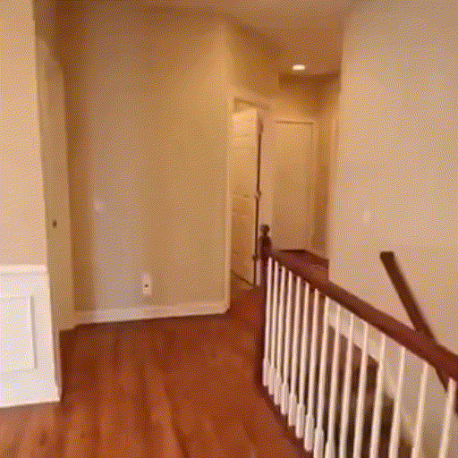</img>
              <div style="width: 200px;">
              <p align="center">Reference video</p>
              </div>
            </td>
            <td>
              </img>
              <div style="width: 200px;">
                <p align="center">A frozen pond surrounded by frost-covered trees.</p>
              </div>
            </td>
          </tr>
        </table>
      </td>
      <!-- 第二组 -->
      <td>
        <table>
          <tr valign="top">
            <td>
              </img>
              <div style="width: 200px;">
              <p align="center">Reference video</p>
              </div>
            </td>
            <td>
              </img>
              <div style="width: 200px;">
              <p align="center">A dense forest with sunlight filtering through the trees.</p>
              </div>
            </td>
          </tr>
        </table>
      </td>
    </tr>
  </table>
</div>


## Quick Start

### Environment Setup
Clone this repo and install the dependencies in the `requirements.txt`.
```
git clone https://github.com/PrototypeNx/EfficientMT.git
cd EfficientMT

conda create -n efficientmt python=3.10
conda activate efficientmt
pip install -r requirements.txt
```

### Model Download
Download the pretrained stable-diffusion-v1-5 adopted by AnimateDiff and put in `models/StableDiffusion/`
```
git lfs install
git clone https://huggingface.co/runwayml/stable-diffusion-v1-5 models/StableDiffusion/
```
In this project, we use the original stable-diffusion-v1-5 version corresponding to `unet/diffusion_pytorch_model.bin` with a size of `3.44GB`. You can manually download each file and put them in `models/StableDiffusion/stable-diffusion-v1-5` with a total size of `3.97GB`.

Download the weights uploaded in [HuggingFace](https://huggingface.co/yfcai/EfficientMT) or [ModelScope](https://www.modelscope.cn/models/q473680239/EfficientMT) and put them in `models/`.

Prepare the motion module `v3_sd15_mm.ckpt` adopted from [AnimateDiff](https://github.com/guoyww/animatediff/) in `models/Motion_Module`. 

Prepare the visual enhancement LoRA module `realisticVisionV60B1_v51VAE.safetensors` adopted from [RealisticVisionV6.0](https://civitai.com/models/4201?modelVersionId=245598) in `models/DreamBooth_LoRA`.

Prepare the pretrained integreted temporal attention weights `checkpoint.ckpt` in `models/Integrated_Attention`.

### Inference
Run the following script to generate the motion transfer results:
```
python inference.py --config configs/prompts/inference.yaml\
                    --ckpt_path models/Integrated_Attention/checkpoint.ckpt \
                    --ref_video_path assets/references/sample_white_tiger.mp4\
                    --prompt "cat walking on the beach."
```
Modify the `ref_video_path` and `prompt` to select reference video and customize your motion transfer prompt.

Or run the following scripts:
```
bash infer.sh
``` 
The motion transfer results are saved in `outputs/<ref_video_name>/`.

## Technical Explanation
<div>
<p align="center">
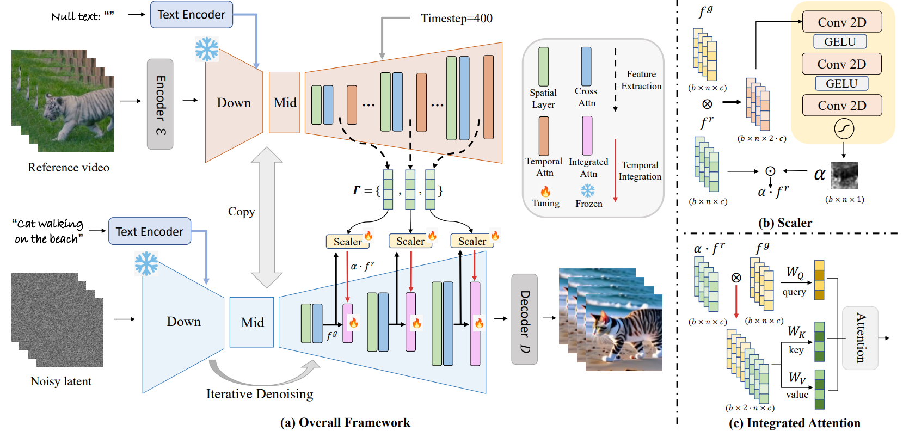
</div>

Overview of our EfficientMT. (a): We reuse the backbone of the T2V model to extract reference features, which are then injected into the temporal attention layers of the upsampling stage through a temporal integration mechanism. (b): The scaler predicts a fine-grained scale map for the reference features, filtering out irrelevant information. (c): The temporal integration concatenates the features along the temporal axis, while the query is projected from the origin, the key and value are obtained from the integrated features.

## Contact Us
[473680239@qq.com](mailto:473680239@qq.com)  


## BibTeX
```
@article{cai2025efficientmt,
  title={EfficientMT: Efficient Temporal Adaptation for Motion Transfer in Text-to-Video Diffusion Models}, 
  author={Yufei Cai and Hu Han and Yuxiang Wei and Shiguang Shan and Xilin Chen},
  journal={arXiv preprint arXiv:2503.19369}, 
  year={2025}
}
```

